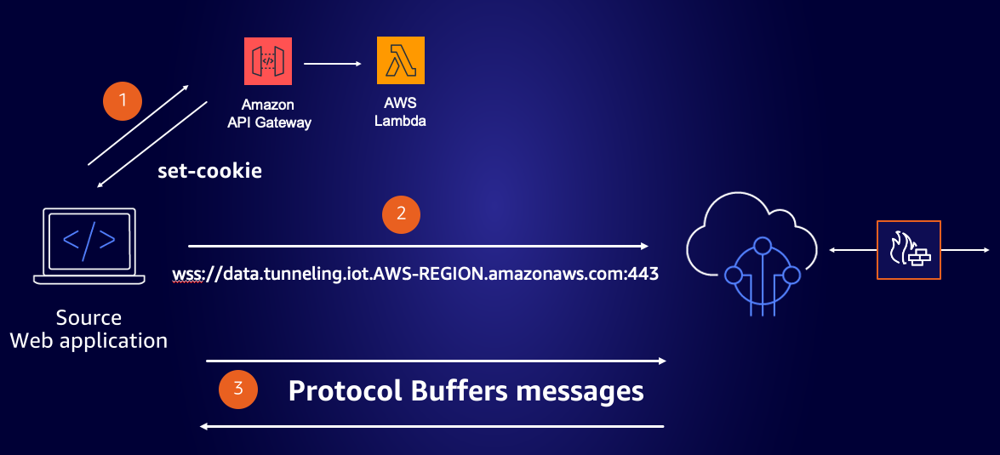
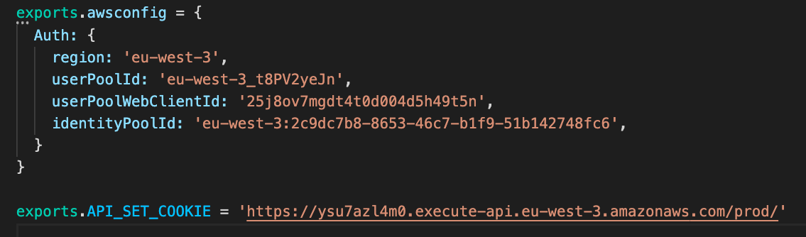
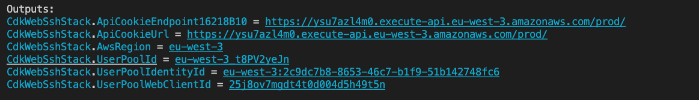
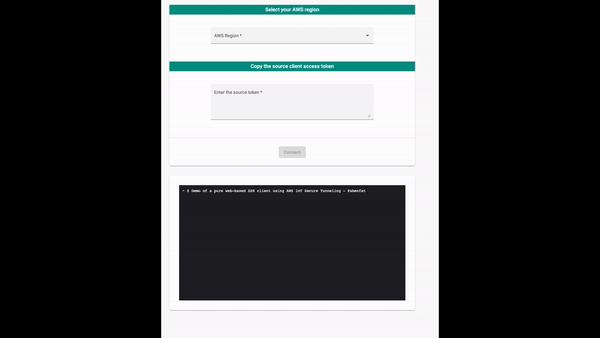

# Using AWS IoT Secure Tunneling to Establish Bidirectional Communication to Remote Devices From a Web Browser

## Introduction 

AWS IoT Secure Tunneling helps customers establish bidirectional communication to remote devices over a secure connection that is managed by AWS IoT. Secure tunneling does not require updates to your existing inbound firewall rule, so you can keep the same security level provided by firewall rules at a remote site.

This web application demonstrates how to use AWS IoT Secure Tunneling to gain access to a remote device from a web browser. 
Nothing to install on the source. 

<br> 

## Secure Tunneling Concepts

As a reminder of the [Secure tunneling concepts](https://docs.aws.amazon.com/iot/latest/developerguide/secure-tunneling-concepts.html), the source is usually the laptop or the desktop computer you use to initiate a session to the destination device. The destination device being the remote device you want to access. 

When a tunnel is created, a pair of tokens (one for the source and one for the destination) is created. These tokens are used by the source and destination devices to connect to the Secure Tunneling service. 

Lastly, a concept worth recalling is the local proxy. The local proxy is a software proxy that runs on the source and destination devices and relays a data stream between the Secure Tunneling service and the device application. The local proxy can be run in source mode or destination mode.
The local proxy establishes a connection to the Secure Tunneling service using WebSocket protocol. The websocket connection is authenticated with the source or the destination token, depending the mode used, that is passed in the header. 

This web application acts as a local proxy for the source. The implementation of [WebSockets inside web browsers](https://developer.mozilla.org/en-US/docs/Web/API/WebSocket) doesn’t support custom headers so we will need to set a cookie as described in the [Secure Tunneling protocol guide](https://github.com/aws-samples/aws-iot-securetunneling-localproxy/blob/master/V1WebSocketProtocolGuide.md). 

As you may know, for security reasons, a website can only set a Cookie to its own domain, or any higher level DNS domain it belongs to.
If for example the domain name of my web application is mylocalproxy.com, it could not set a cookie for the tunnelling service which has an endpoint like data.tunneling.iot.AWS_REGION.amazonaws.com. 

In order to set a cookie for the tunnelling service, we will use then Amazon API Gateway with AWS Lambda proxy integration to set the cookie for the .amazonaws.com domain (this cookie will be shared across the setting domain and all sibling and child domains). 

***Some browsers might not send the cookie to the domain us-east-1.amazonaws.com as it is in the [public suffix list](https://publicsuffix.org/list/). This list is used in browsers to limit the scope of a cookie. A workaround for us-east-1 region is to manually set the cookie in [the console of the web browser](https://developer.chrome.com/docs/devtools/storage/cookies/).*** 

<br>

## Architecture



<br> 


## Prerequisites

- [Angular CLI](https://angular.io/cli) to launch the angular web application
- [AWS CDK](https://docs.aws.amazon.com/cdk/latest/guide/getting_started.html#getting_started_install) if you use the CDK application provided in this repository to set up Amazon Cognito and the API needed to run the web application 

## Getting started 

The first step is to set up the configuration file [```webapp/src/awsconfig.js```]('./webapp/src/awsconfig.js). 

<br> 




The web application uses Amazon cognito for authentication so we need to provide: 
- the ```userPoolId```, 
- the ```userPoolWebClientId```, 
- the ```identityPoolId```
- and the ```region```

Finally we need to provide the link to the API Gateway endpoint that we will use to set the cookie in the web browser.

We provide in this repository a [cdk](https://aws.amazon.com/cdk/) application that you can deploy to set up everything.

### Deploy the CDK application

<br> 

This cdk application will create an Amazon API Gateway endpoint integrated with an AWS Lambda function that will be used to set the cookie. This will also set up Amazon Cognito and create a user to authenticate in the web application. 

The first step is to set the username and password you will use to connect to the web application. The configuration is made in the file ```cdkwebapp/parameters.ts``` (default is username: iotcore && password: iotcore).

To deploy the cdk application, navigate to the folder ```cdkwebapp``` and install the libraries with: 

```
npm install 
```

The stack uses assets, so we need to bootstrap the environment:

```
cdk bootstrap
```

and then deploy the stack:

```
cdk deploy --require-approval never
```

Once the application is deployed you can get all the needed configuration parameters in the output: 

<br>




### Launch the web application

Once the the ```awsconfig.js``` file is configured, you can launch the web application. Navigate to the folder ```webapp``` and install the libraries with: 

```
npm install 
```

Now you can launch the web application:

```
ng serve
```

You should see your angular application running at http://localhost:4200.

<br> 



## Online demo

You can use the online demo by clicking on this [link](https://d27s40qf47wdc3.cloudfront.net/). 

The username and the password are both ```iotcore```.

## Credits

The web application is using part of the [SSHy: HTML5 based SSH client](https://github.com/stuicey/SSHy)


